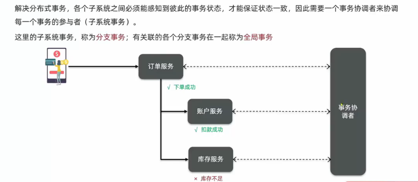
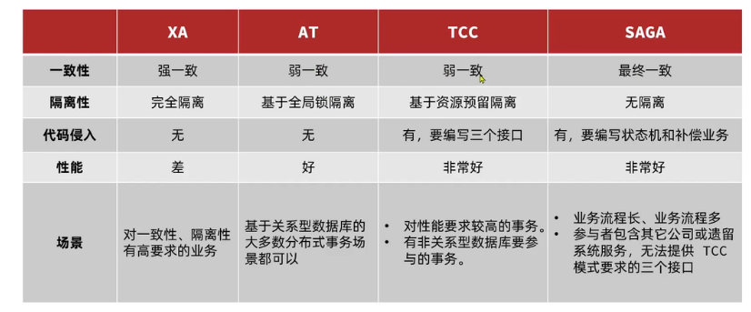

>**事务的ACID原则**
>- 原子性: 事务中的所有操作, 要么全部成功, 要么全部失败
>- 一致性: 要保证数据库内部完整性约束, 声明性约束
>- 隔离性: 对同一资源操作的事务不能同时发生
>- 持久性: 对数据库做的一切修改将永久保存, 不管是否出现故障

# 分布式事务
## 一. 分布式事务原理(理论基础)
在分布式系统下, 一个业务跨越多个服务或数据源, 每个服务都是一个分支事务, 要保证所有分支事务最终状态一致, 这样的事务就是分布式事务

### (1). CAP定理
分布式系统的三个指标:
- `Consistency (一致性)`
  - 用户访问分布式系统中的任意节点, 得到的数据必须一致
- `Availability (可用性)`
  - 用户访问集群中的任意健康节点, 必须能得到响应, 而不是超时或拒绝
- `Partition tolerance (分区容错性)`
  - 因为网络故障或其他原因导致分布式系统中的部分节点与其他节点失去连接, 形成独立分区
  
  
- 分布式系统无法同时满足这三个指标, 这个结论就叫做CAP定理
  

**简述CAP定理内容**
- 分布式系统节点通过网络连接, 一定会出现分区问题(P)
- 当分区出现时, 系统的一致性(C)和可用性(A)就无法同时满足

**elasticsearch集群时CP还是AP?**
- ES集群出现分区时, 故障节点会被剔除集群, 数据分片会重新分配到其他节点, 保证数据一致, 因此是低可用性, 高一致性, 属于CP

### (2). BASE理论
BASE理论是对CAP的一种解决思路, 包含三个思想:
- `Basically Available(基本可用)`: 分布式系统在出现故障时, 允许损失部分可用性, 即保证核心可用.
- `Soft State(软状态)`: 在一定时间内, 允许出现中间状态, 比如临时的不一致状态.
- `Eventually Consistent(最终一致性)`: 虽然无法保证强一致性, 但是在软状态结束后, 最终达到数据一致.

而分布式事务最大的问题是各个子事务的一致性问题, 因此可以借鉴`CAP定理和BASE理论`:
- `AP模式`: 各个子事务分别执行和提交, 允许出现结果不一致, 然后采用弥补措施即可, 实现最终一致
- `CP模式`: 各个子事务执行后互相等待, 同时提交, 同时回滚, 达成强一致, 但事务等待过程中, 处于弱可用状态

### (3). 分布式事务模型



## 二. 初始Seata
### (1). Seata的架构


**Seata提供了四种不同的分布式事务解决方案**
- XA模式: 强一致性分阶段事务模式, 牺牲了一定的可用性, 无业务侵入
- TCC模式: 最终一致的分阶段事务模式, 有业务侵入
- AT模式: 最终一致的分阶段事务模式, 无业务侵入, 也是Seata的默认模式
- SAGA模式: 长事务模式, 有业务侵入

### (2). 部署TC服务
[seata的部署和集成.md](resources/seata的部署和集成.md)

### (3). 微服务集成Seata
#### A. XA模式
XA规范是 X/Open组织定义的分布式事务处理(DTP, Distributed Transaction Processing) 标准, XA规范描述了全局的TM与局部的RM之间的接口, 几乎所有主流的数据库都对XA规范提供了支持.


seata的XA模式做了一些调整, 但大体相似


RM一阶段的工作:
1. 注册分支事务到TC
2. 执行分支业务sql但不提交
3. 报告执行状态到TC

TC二阶段的工作:
- TC检测各分支事务的执行状态
  - 如果都成功, 通知所有的RM提交事务
  - 如果有失败, 通知所有RM回滚事务

RM二阶段的工作: 
  - 接收TC指令, 提交或回滚事务

XA模式的优点是什么?
- 事务的强一致性, 满足ACID原则
- 常用数据库都支持, 实现简单, 并且没有代码侵入

XA模式的缺点是什么?
- 因为一阶段需要锁定数据库资源, 等待二阶段结束才释放, 性能较差
- 依赖关系性数据库实现事务

#### B. AT模式
AT模式同样是分阶段提交的事务模型, 不过却弥补了XA模型中资源锁定周期过长的缺陷

阶段一RM的工作:
- 注册分支事务
- 记录undo-log (数据快照)
- 执行业务sql并提交
- 报告事务状态

阶段二提交时RM的工作
- 删除undo-log即可

阶段二回滚时RM的工作:
- 根据undo-log恢复数据到更新前


**简述AT模式与XA模式最大的区别是什么?**
- XA模式一阶段不提交事务, 锁定资源; AT模式一阶段直接提交, 不锁定资源.
- XA模式依赖数据库机制实现回滚; AT模式利用数据快照实现数据回滚.
- XA模式强一致; AT模式最终一致.

AT模式的脏写问题


解决方法: 全局锁: 有TC记录当前正在操作某行数据的事务, 该事务持有全局锁, 具备执行权


**AT模式的优点和缺点**
- 优点：
  - 一阶段完成直接提交事务， 释放数据库资源， 性能比较好.
  - 利用全局锁实现读写隔离
  - 没有代码侵入, 框架自动完成回滚和提交
- 缺点： 
  - 两阶段之间属于软状态, 属于最终一致
  - 框架的快照功能会影响性能, 但比XA模式要好很多

#### C. TCC模式
TCC模式与AT模式非常相似, 每阶段都是独立事务, 不同的是TCC通过人工编码来实现数据恢复. 需要实现三个方法:
- Try: 资源的检测和预留.
- Confirm: 完成资源操作业务; 要求Try成功Confirm一定要能成功.
- Cancel: 预留资源释放, 可以理解为try的反向操作.


TCC模式原理


TCC的优点是什么?
- 一阶段完成直接提交事务, 释放数据库资源, 性能好
- 相比AT模型, 无需生成快照, 无需使用全局锁, 性能最强
- 不依赖数据库事务, 而是依赖补偿操作, 可以用于非事务型数据库

TCC的缺点是什么?
- 有代码侵入, 需要人为编写try, Confirm和Cancel接口, 太麻烦
- 软状态, 事务是最终一致
- 需要考虑Confirm和Cancel的失败情况, 做好幂等处理(幂等性: 其任意多次执行对资源本身所产生的影响均与一次执行的影响相同)

**TCC现有问题**
1. 空回滚
   1. 当某分支事务的try阶段阻塞时, 可能导致全局事务超时而触发二阶段的cancel操作, 
   在未执行try操作时先执行了cancel操作, 这时cancel不能做回滚, 就是空回滚
2. 业务悬挂
   1. 对于已经空回滚的业务, 如果以后继续执行try, 就永远不可能confirm或cancel, 
   这就是业务悬挂, 应当阻止执行空回滚后的try操作, 避免悬挂
3. 解决方式: 为了实现空回滚, 防止业务悬挂, 以及幂等性要求, 我们必须在数据库记录冻结
金额的同时, 记录当前事务id和执行状态, 为此设计一张账户冻结表:
```mysql
SET NAMES utf8mb4;
SET FOREIGN_KEY_CHECKS = 0;

-- ----------------------------
-- Table structure for account_freeze_tbl
-- ----------------------------
DROP TABLE IF EXISTS `account_freeze_tbl`;
CREATE TABLE `account_freeze_tbl`  (
  `xid` varchar(128) CHARACTER SET utf8 COLLATE utf8_general_ci NOT NULL,
  `user_id` varchar(255) CHARACTER SET utf8 COLLATE utf8_general_ci NULL DEFAULT NULL,
  `freeze_money` int(11) UNSIGNED NULL DEFAULT 0,
  `state` int(1) NULL DEFAULT NULL COMMENT '事务状态，0:try，1:confirm，2:cancel',
  PRIMARY KEY (`xid`) USING BTREE
) ENGINE = InnoDB CHARACTER SET = utf8 COLLATE = utf8_general_ci ROW_FORMAT = COMPACT;

-- ----------------------------
-- Records of account_freeze_tbl
-- ----------------------------

SET FOREIGN_KEY_CHECKS = 1;
```

**Try业务**
- 记录冻结金额和事务状态到account_freeze表
- 扣减account表可用金额

**Confirm业务**
- 根据xid删除account_freeze表的冻结记录

**Cancel业务**
- 修改account_freeze表, 冻结金额为0, state为2
- 修改account表, 恢复可用金额

**如何判断是否空回滚**
- cancel业务中, 根据xid查询account_freeze, 如果为null则说明try还没做, 需要空回滚

**如何避免业务悬挂**
- try业务中, 根据xid查询account_freeze, 如果已经存在则证明Cancel已经执行, 拒绝执行try业务

```java
@Slf4j
@Service
public class AccountTCCServiceImpl implements AccountTCCService {

    @Autowired
    private AccountMapper accountMapper;

    @Autowired
    private AccountFreezeMapper freezeMapper;

    @Override
    @Transactional
    public void deduct(String userId, int money) {
        /*0. 获取事务id*/
        String xid = RootContext.getXID();
        /*解决业务悬挂问题*/
        /*判断freeze中是否有冻结记录, 如果有, 一定是CANCEL执行过, 拒绝业务*/
        AccountFreeze oldFreeze = freezeMapper.selectById(xid);
        if (oldFreeze != null) {
            /*CANCEL执行过, 拒绝业务*/
            return;
        }
        /*1. 扣减可用余额*/
        accountMapper.deduct(userId, money);
        /*2. 记录冻结金额, */
        AccountFreeze freeze = new AccountFreeze();
        freeze.setUserId(userId);
        freeze.setFreezeMoney(money);
        freeze.setState(AccountFreeze.State.TRY);
        freeze.setXid(xid);
        freezeMapper.insert(freeze);
    }

    @Override
    public boolean confirm(BusinessActionContext context) {
        /*1. 获取事务id*/
        String xid = context.getXid();
        /*2. 根据id删除冻结记录*/
        int count = freezeMapper.deleteById(xid);
        return count == 1;
    }

    @Override
    public boolean cancel(BusinessActionContext context) {
        String xid = context.getXid();
        AccountFreeze freeze = freezeMapper.selectById(xid);
        String userId = Objects.requireNonNull(context.getActionContext("userId")).toString();

        /*0. 空回滚判断, 判断freeze是否为null, 为null证明try没执行, 需要空回滚*/
        if (freeze == null) {
            /*保存空回滚的记录*/
            freeze = new AccountFreeze();
            freeze.setUserId(userId);
            freeze.setFreezeMoney(0);
            freeze.setState(AccountFreeze.State.CANCEL);
            freeze.setXid(xid);
            freezeMapper.insert(freeze);
            return true;
        }
        /*判断幂等, 一个业务在事务中只能执行一次*/
        if (freeze.getState() == AccountFreeze.State.CANCEL) {
            /*已经处理过一次, 无需再次执行*/
            return true;
        }
        /*1. 恢复可用余额*/
        accountMapper.refund(freeze.getUserId(), freeze.getFreezeMoney());
        /*2. 将冻结金额清零, 状态改为CANCEL*/
        freeze.setFreezeMoney(0);
        freeze.setState(AccountFreeze.State.CANCEL);
        /*3. 更新*/
        int count = freezeMapper.updateById(freeze);
        return count == 1;
    }
}
```

#### D. SAGA模式
Saga模式是SEATA提供的长事务解决方案, 也分为两个阶段:
- 一阶段: 直接提交本地事务
- 二阶段: 成功则什么都不做; 失败则通过编写补偿业务来回滚

Saga模式的优点:
- 事务参与者可以基于事件驱动实现异步调用, 吞吐高
- 一阶段直接提交事务, 无锁, 性能好
- 不同=用编写TCC中的三个阶段, 实现简单

缺点: 
- 软状态持续时间不确定, 失效性差
- 没有锁, 没有事务隔离, 会有脏写


**四种模式对比**



## 三. 高可用
### (1). 高可用集群结构
TC服务作为Seata的核心服务器, 一定要保证高可用和异地容灾


### (2). 实现高可用集群

[seata的部署和集成.md](resources/seata的部署和集成.md)


